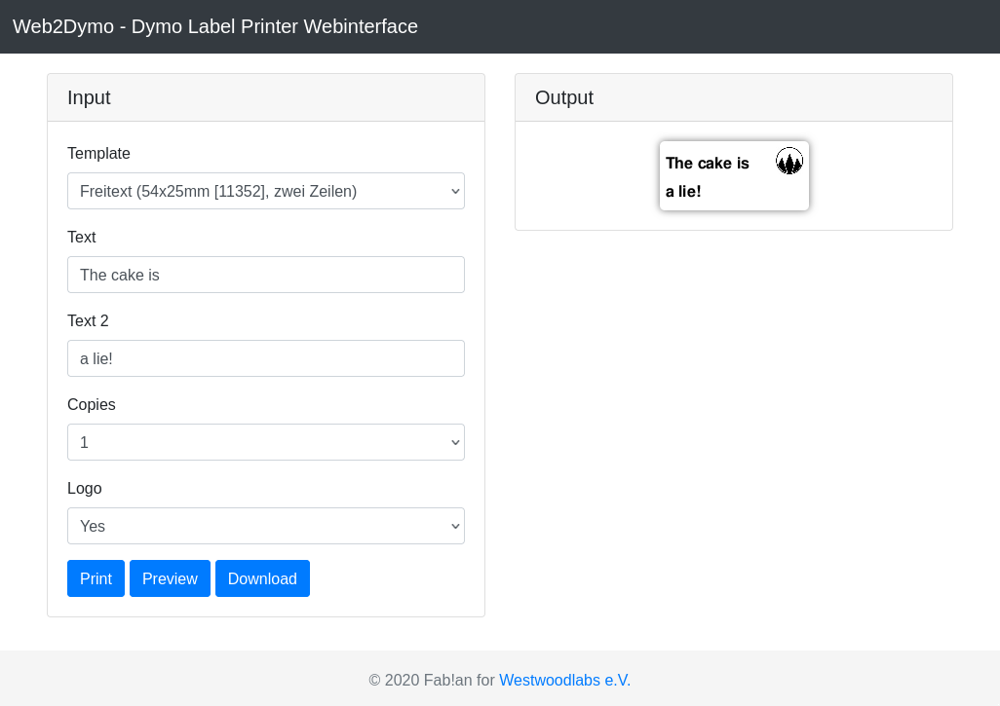

# Web2Dymo-docker - Dockerized Dymo Label Printer Webinterface

Web2Dymo is a simple webinterface to print labels on Dymo Label Printers. This docker image uses PHP and CUPS to print on a network print server.



## Usage

Example docker-compose configuration:

```yml
version: "3"

services:
  app:
    build:
      context: ./app
    restart: unless-stopped
    volumes:
      - "./data/web:/var/www/html"
    ports:
      - 80:80
    environment:
      PRINTER1_ENABLE: 1
      PRINTER1_NAME: dymo450
      PRINTER1_DEVURI: socket://url.to.print.server:9100
      PRINTER1_PPDFILE: /usr/share/cups/model/lw450.ppd
      PRINTER2_ENABLE: 1
      PRINTER2_NAME: dymo320
      PRINTER2_DEVURI: socket://url.to.print.server:9101
      PRINTER2_PPDFILE: /usr/share/cups/model/lw320.ppd
```
